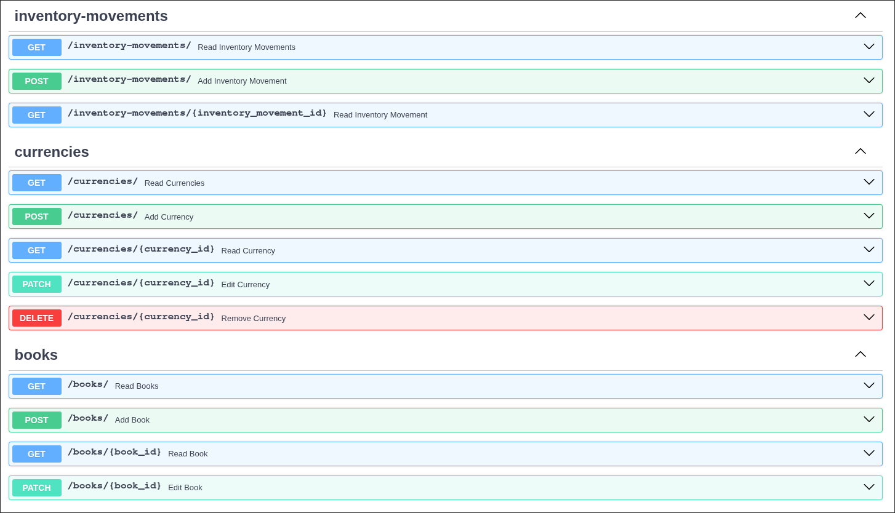
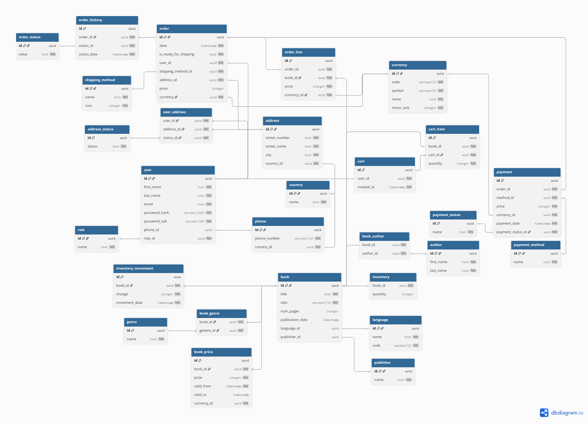

# Bookstore App

A full-stack application for managing an online bookstore. It handles books, publishers, authors, users and more.

## Table of Content

- [Getting Started](#getting-started)
    - [Installation](#installation)
    - [Testing](#testing)
    - [Usage](#usage)
- [Technology Stack and Features](#technology-stack-and-features)
- [Why This Project?](#why-this-project)
- [Contributing](#contributing)
- [License](#license)

## Getting Started

### Installation

1. Clone the repository

```bash
git clone git@github.com:zdenva/bookstore-app.git
```

2. Navigate to project folder

```bash
cd bookstore-app`
```

3. Optionally change environment variables with value `changethis` in `.env` file

4. Run docker compose

```bash
docker compose up
```

### Testing

Backend has own unit tests which can be started during docker compose runtime.

```bash
docker compose exec backend bash scripts/tests-start.sh
```

Coverage info is created which can be viewed from `htmlcov` folder from file `index.html`.

### Usage

From the current state of application can be used backend API part where can be managed books.



For building API is used ERD diagram.



## Technology Stack and Features

- [FastAPI](https://fastapi.tiangolo.com) Python backend API.
    - [SQLModel](https://sqlmodel.tiangolo.com) Python SQL database. interactions (ORM).
    - [Pydantic](https://docs.pydantic.dev) for the data validation and settings management.
    - [PostgreSQL](https://www.postgresql.org) SQL database.
- [Svelte](https://svelte.dev) for the frontend.
    - ...

## Why this Project?

I choose to work on this project because I had previously designed database structure and wanted to apply backend and frontend skills in a full-stack application.

## Contributing

Pull requests are welcome. For major changes please open an issue first.

## License

This project is licensed under the [MIT License](<(https://opensource.org/licenses/MIT)>) see the [`LICENSE`](LICENSE) file for details.
